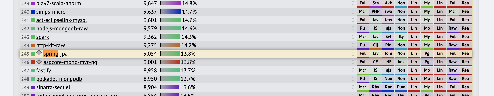
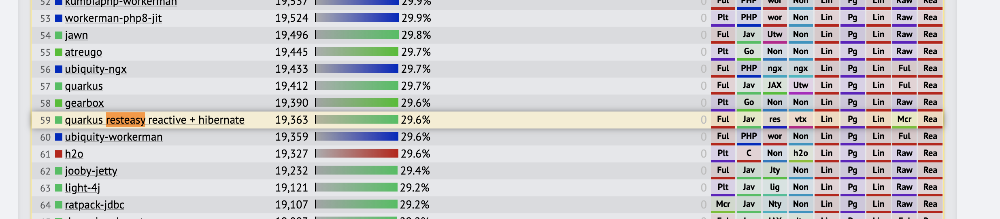
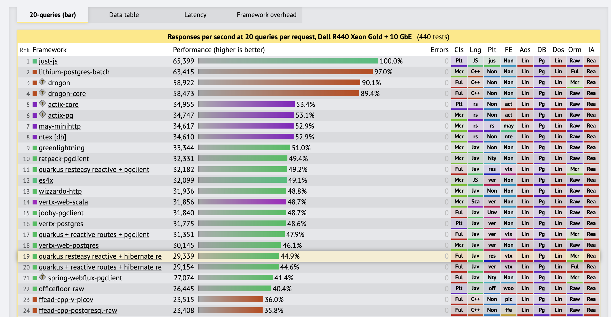

# 요구사항 정리

1. ***개발 생산성*** ❗
1. 무중단
1. 성능 향상

---
 
 
 
 

# AS-IS

---
###### AS-IS
## 개발 생산성 증가(프레임워크 의존성 느슨하게 개선 필요)
- `spring` -> `spring-security` -> `spring-security-oauth` 프레임워크의 제약이 큼.
  - 과거 apple login 기능을 붙이기 위해 2달이 소요
  - 프레임워크의 제약에서 기능을 붙이려다보니 제공하지 않는 기능을 구현하기 위해 프레임워크의 기능을 회피하는 기능을 넣다보니 불필요한 기능등이 들어가고 *복잡성 증가*
  - spring bootstrap 시간이 김
    - 개발속도저하, 배포 시간 증가(10분이상 소요) => 불필요한 로딩이 많아 시간비용큼
  - spring version 2.1.3

---
###### AS-IS
## 개발 생산성 증가(프레임워크 의존성 느슨하게 개선 필요)

- spring cloud
  - zuul, eureka, config server, feign...
- spring security oauth

--- 
###### AS-IS
## 개발 생산성 증가(front / backend 분리 필요)
- thymeleaf
  - browser에서 해석할 html, javascript, css 영역을 백엔드에서 render
    -  view를 위한 로직들이 다수 백엔드에서 핸들링하다보니 프론트에서 손쉽게할 수 있는 기능을 복잡하게 구현하는 경우가 많다. 특히, A페이지에서 B페이지로 갔다가 A로 돌아오는 경우는 상태 공유를 위해 백엔드에서 불필요한 비지니스 코드를 넣는 경우가 다수 발생

--- 
###### AS-IS
## 개발 생산성 증가(front / backend 분리)
- thymeleaf
    - html 구조, class등이 바뀌는 경우 백엔드의 thymeleaf를 수정해줘야하는데 마크업쪽에서 준 그대로 쓰는게 아니고 내부적으로 코드를 재구성하기 때문에 변경을 하게 되면 쉽게 변경이 되지 않음.
    - javascript로 html을 그리는 경우는 다시 개발하는게 빠름
    - javascript es6 이상의 모던한 피처들을 사용하지 못함

--- 
###### AS-IS
## 개발 생산성 증가
- login flow 및 기타 비지니스 정책 정리 필요
  - 기존에 구현시 요구사항만을 충족하기위해서 붙인 기능들이 현재 레거시로 남아 사용이 안되거나 불필요한 버그로 나오는 경우가 발생

--- 
###### AS-IS
## 성능 개선
- 부하 테스트 (ecs - 1vcpu/2GB * 2)
  - id/password login - 10TPS 미만
     - bcrypt 해싱 비용
  - 로그인 페이지 랜딩 150TPS 미만

--- 
###### AS-IS
## 개발 생산성 증가
- 테스트 코드의 부재

---
 
 
 
 

# TO-BE

---
###### `개발생산성` TO-BE
## java -> `kotlin`

---
###### `개발생산성` TO-BE
## front / backend 분리

- `react js`
- `typescript`
- `redux-saga`

---
###### `개발생산성` TO-BE
## front / backend 분리
- 백엔드 api 변경에 따른 front와의 코드 불일치
- api 문서 관리

`openapi`를 이용하여 document & code 자동 생성을 통해 반복적인 비용 제거

---
###### `개발생산성` TO-BE
## 백엔드 프레임워크
-  `quarkus` (Java EE 기반의 DI framework)
    - 개발
        - 빠른 bootstrap
        - live reload
    - 배포
        - native build -> 빠른 기동 시간, auto scale out, [optimize](https://www.graalvm.org/reference-manual/compiler/)
        - 적은 메모리 사용
        

---

###### `개발생산성` TO-BE
## 백엔드 프레임워크

[출처](https://www.techempower.com/benchmarks/#section=data-r20&hw=ph&test=query)

---
###### `개발생산성` TO-BE
## 백엔드 프레임워크

[출처](https://loadteststories.com/graalvm-vs-jvm-a-kubernetes-match-memory-cpu-garbage-collector-in-openshift/)        

---

 
 
 
 

## (참고) java community process 소개

---

---

---

---

---

---
###### `개발생산성` TO-BE
## 백엔드 프레임워크

[JSR-365](https://jcp.org/en/jsr/detail?id=365) - DI - quarkus

[JSR-370](https://jcp.org/en/jsr/detail?id=370) - JAX-RS - resteasy

[JSR-303](https://jcp.org/en/jsr/detail?id=303) - Bean validation - hibernate validator

[JSR-338](https://jcp.org/en/jsr/detail?id=338) - JPA - hibernate orm

자바의 표준 기술을 사용하였기 때문에 큰 소스 변경 없이 spring 및 다른 EE 프레임워크로 전환 가능

---
###### `개발생산성` TO-BE
## 백엔드 프레임워크

- hibernate를 그대로 유지함으로 기존 DB에 대한 변경 없이 application layer만 새로 개발.
  - 기존 batch 및 backoffice의 변경 최소화
    - batch : 유지
    - backoffice : member-api를 10여개정도 사용

---
###### `개발생산성` TO-BE
## service 레이어의 모든 코드는 test 작성

- 소스 변경에 따른 사이드 이펙트를 줄일 수 있어 개발/운영 비용을 줄인다.

---
###### `개발생산성` TO-BE
## code 품질의 지속성을 위한 정적 분석 도구 사용

---
###### `개발생산성` TO-BE
## code 품질의 지속성을 위한 정적 분석 도구 사용

- 코드의 규모가 커지면 커질수록 정적분석도구를 통해 개발자 리소스를 줄일 수 있다.

---
###### `무중단`, `성능향상` TO-BE
## CQRS(Command Query Responsibility Separation) 적용
- Query Side
  - cache aerospike()
- Command Side
  - mysql

`개발생산성`을 위한 개편에서 CQRS 적용을 고려한 API design 필요.
최초 개발에는 mysql에서 read/write 진행. 이후 cache 레이어에서 읽을 수 있도록 분리 진행

---
###### `성능향상` TO-BE
## NIO(NonBlocking IO) 도입

---

---
## 1-1

---

## 1-2

---

---

---

## 

---
## 결론

1. 개발 생산성 20프로 증대 예상 (테스트 비용, 복잡도 감소 영향)
    - ex. 5일 태스크 4일로 감소 예상
2. 점검시 로그인 무중단 기능 제공
3. 성능향상 500% 이상 예상

---
##  

 
 
 
 

# 감사합니다